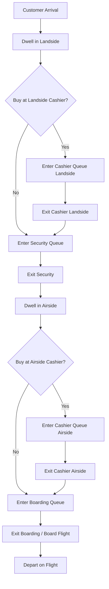

# Airport Departure Lounge Simulation Model

## Overview

This is a **Discrete Event Simulation (DES)** model that simulates the operations of an airport departure lounge over a 24-hour period. The model captures the complete passenger journey from arrival at the airport through check-in, security screening, airside activities, and boarding, culminating in flight departure.

---

## Model Architecture

### Simulation Paradigm

The model follows a **discrete-event simulation** approach using a **Future Event Set (FES)** pattern with a priority queue. Events are scheduled and processed in chronological order, with the simulation advancing from one event to the next.

**Key architectural components:**
- Event-driven architecture with 9 distinct event types
- Priority queue-based event scheduling
- Multiple service queues with different priority policies
- Time-weighted metric collection
- Stochastic processes for arrivals, service times, and customer behavior

---

## Event Types

The simulation handles **9 event types** that model the passenger journey and flight operations:

| Event Type | Description | Triggers |
|------------|-------------|----------|
| `FLIGHT_SCHEDULED` | A flight is scheduled with passengers | Customer arrivals for that flight |
| `CUSTOMER_ARRIVAL` | Passenger group arrives at airport | Check-in or security queue entry |
| `ENTER_CASHIER_QUEUE` | Passenger enters cashier queue (landside or airside) | Cashier service or queueing |
| `EXIT_CASHIER_QUEUE` | Passenger completes cashier service | Next queue entry (security/boarding) |
| `ENTER_SECURITY_QUEUE` | Passenger enters security screening queue | Security service or queueing |
| `EXIT_SECURITY_QUEUE` | Passenger completes security screening | Airside activities |
| `ENTER_BOARDING_QUEUE` | Passenger enters boarding queue | Boarding service |
| `EXIT_BOARDING_QUEUE` | Passenger boards aircraft | Passenger departure |
| `FLIGHT_DEPARTURE` | Flight departs with all boarded passengers | Cleanup and passenger removal |

---

## Main Data Structures

### 1. **Event** Class
```python
class Event:
    event_type: EventType
    time: float
    customer_id: Optional[int]
    flight_id: Optional[int]
    cancelled: bool
```
**Purpose:** Represents a discrete event in the simulation with timing and entity references.

**Key features:**
- Comparable by time for priority queue ordering
- Cancellable to handle dropped passengers
- Links to both passengers and flights

---

### 2. **Passenger** Class
```python
class Passenger:
    passenger_id: int
    arrival_time: float
    priority_class: PriorityClass  # FIRST_CLASS, BUSINESS, ECONOMY
    flight_id: int
    num_companions: int
    state: PassengerState
    # Timing attributes for all stages
```
**Purpose:** Models individual passengers with their journey through the airport.

**Priority classes:** `FIRST_CLASS (1)`, `BUSINESS (2)`, `ECONOMY (3)` - lower numbers = higher priority

**State transitions:**
```
ARRIVED → IN_CASHIER_LAND → IN_SECURITY → IN_AIRSIDE → 
IN_CASHIER_AIR → IN_BOARDING → LEFT_AIRPORT
```

**Timing tracking:**
- Queue entry times (cashier, security, boarding)
- Service entry/exit times
- Total journey timestamps

---

### 3. **Flight** Class
```python
class Flight:
    flight_id: int
    takeoff_time: float
    num_passengers: int
    boarding_duration: float
    boarding_start_time: float
    passengers: dict[int, Passenger]
    served_passengers: int
```
**Purpose:** Represents scheduled flights and manages associated passengers.

**Key features:**
- Tracks expected vs. actual boarded passengers
- Computes drop percentage
- Manages boarding window timing

---

### 4. **QueueSystem** Class
```python
class QueueSystem:
    num_servers: int
    priority: bool
    server_busy: int
    waiting_queue: list[Passenger]
    active_clients: dict[int, Passenger]
    serving_clients: dict[int, Passenger]
```
**Purpose:** Manages service queues with configurable server count and priority policies.

**Queue types in model:**
- **Cashier (Landside)**: FIFO, no priority
- **Cashier (Airside)**: FIFO, no priority
- **Security**: Priority-based (First Class → Business → Economy)
- **Boarding**: Priority-based per flight

---

### 5. **FutureEventSet** Class
```python
class FutureEventSet:
    events: PriorityQueue[Event]
    event_count: int
```
**Purpose:** Maintains chronologically ordered event queue using Python's `PriorityQueue`.

**Operations:**
- `schedule(event)`: Add event to queue
- `get_next_event()`: Retrieve next non-cancelled event
- Automatically skips cancelled events

---

### 6. **Metrics** Class
```python
class Metrics:
    # Counters
    total_customer_arrivals: int
    total_passengers_arrivals: int
    total_flights: int
    dropped_passengers: int
    
    # Time-weighted accumulations
    area_under_airport_customers: float
    area_under_security_queue: float
    area_under_boarding_queue: float
    # ... more areas
    
    # Service utilization
    cashier_land_utilization_time: float
    security_utilization_time: float
    boarding_utilization_per_flight: dict[int, float]
    
    # Per-priority tracking
    security_wait_time_per_priority: dict[PriorityClass, list[float]]
    boarding_wait_time_per_priority: dict[PriorityClass, list[float]]
    total_time_per_priority: dict[PriorityClass, list[float]]
    
    # Sample statistics
    samples_number_in_airport: list[tuple[float, int]]
    samples_number_in_landside: list[tuple[float, int]]
    # ... more samples
```
**Purpose:** Comprehensive metric collection system using time-weighted statistics.

---

## Key Performance Indicators (KPIs)

### 1. **Passenger Flow Metrics**

| KPI | Description | Formula |
|-----|-------------|---------|
| **Total Customer Arrivals** | Total people entering airport (passengers + companions) | Direct count |
| **Total Passenger Arrivals** | Number of ticketed passengers | Direct count |
| **Dropped Passengers** | Passengers who missed their flight | Count of removed passengers |
| **Drop Percentage** | Percentage of passengers missing flights | `(dropped / total) × 100` |

---

### 2. **Dwell Time Metrics**

| KPI | Description | Measurement |
|-----|-------------|-------------|
| **Landside Dwell Time** | Time from arrival to security entry | `security_entry_time - arrival_time` |
| **Airside Dwell Time** | Time from security exit to departure | `departure_time - security_exit_time` |

**Computed as:** Average across all passengers

---

### 3. **Queue Wait Time Metrics**

| Queue | Description | Priority-Aware |
|-------|-------------|----------------|
| **Cashier (Landside) Wait** | Time in landside cashier queue | No |
| **Cashier (Airside) Wait** | Time in airside cashier queue | No |
| **Security Wait** | Time in security queue | **Yes** - tracked per priority class |
| **Boarding Wait** | Time in boarding queue | **Yes** - tracked per priority class |

**Priority-aware tracking:** First Class, Business, and Economy passengers have separate wait time distributions.

---

### 4. **Occupancy Metrics (Time-Weighted Averages)**

These use the **area under the curve** method:

$$\text{Average Occupancy} = \frac{\int_0^T N(t) \, dt}{T} = \frac{\text{Area Under Curve}}{\text{Simulation Time}}$$

| KPI | Description |
|-----|-------------|
| **Average Number in Airport** | Total passengers in airport system |
| **Average Number in Landside** | Passengers before security |
| **Average Number in Airside** | Passengers after security |
| **Average Cashier Queue Length** | Time-weighted queue length |
| **Average Security Queue Length** | Time-weighted queue length |
| **Average Boarding Queue Length** | Time-weighted queue length |

---

### 5. **Resource Utilization Metrics**

$$\text{Utilization} = \frac{\text{Total Busy Time}}{\text{Total Capacity Time}} = \frac{\text{Total Busy Time}}{\text{Simulation Time} \times \text{Number of Servers}}$$

| Resource | Servers | Utilization Calculation |
|----------|---------|------------------------|
| **Cashier (Landside)** | 17 | Total service time / (24 hours × 17) |
| **Cashier (Airside)** | 8 | Total service time / (24 hours × 8) |
| **Security** | 8 | Total service time / (24 hours × 8) |
| **Boarding** | 2 per flight | Average across flights: service time / (45 min × 2) |

**Target utilization:** Typically 70-85% for good balance between efficiency and service quality.

---

### 6. **Per-Priority Class Performance**

For each priority class (First Class, Business, Economy):

| Metric | Description |
|--------|-------------|
| **Average Security Wait** | Mean time in security queue |
| **Average Boarding Wait** | Mean time in boarding queue |
| **Average Total Time** | Mean time from arrival to departure |

**Purpose:** Evaluate effectiveness of priority policies and premium service quality.

---

## Simulation Logic Flow

### 1. **Initialization Phase**
```
1. Schedule first flight at t=360 min (6:00 AM)
2. Generate passengers for flight (Poisson distribution)
3. For each passenger:
   - Generate arrival time (Normal distribution before flight)
   - Assign priority class (70% Economy, 20% Business, 10% First)
   - Generate companions (Poisson distribution)
   - Schedule CUSTOMER_ARRIVAL event
4. Schedule FLIGHT_DEPARTURE event
5. Schedule next flight (every 20 minutes)
```

---

### 2. **Customer Journey Flow**



---

### 3. **Event Handling Details**

#### **CUSTOMER_ARRIVAL**
1. Determine if passenger will shop (probability = 0.8)
2. Generate landside dwell time (Exponential distribution)
3. Check time constraint: must reach security before cutoff
4. If insufficient time: skip shopping, reduce dwell time
5. Schedule next event: `ENTER_CASHIER_QUEUE` or `ENTER_SECURITY_QUEUE`

#### **ENTER_CASHIER_QUEUE**
1. Add passenger to queue (FIFO order)
2. If server available:
   - Remove passenger from queue
   - Allocate server
   - Generate service time (scales with companions)
   - Schedule `EXIT_CASHIER_QUEUE`

#### **EXIT_CASHIER_QUEUE**
1. Record wait time and service time
2. Update utilization metrics
3. Free server
4. Route passenger to next stage (security or boarding)
5. If queue not empty: serve next passenger

#### **ENTER_SECURITY_QUEUE**
1. Add passenger to queue (Priority order: First → Business → Economy)
2. Companions leave at security (not ticketed)
3. If server available: start service

#### **EXIT_SECURITY_QUEUE**
1. Record wait time (by priority class)
2. Passenger enters airside
3. Decide if passenger will shop airside
4. Schedule next event with time constraints

#### **ENTER_BOARDING_QUEUE**
1. Check if boarding window is open (45 min before departure)
2. Add to priority queue
3. If server available: start boarding

#### **EXIT_BOARDING_QUEUE**
1. Record wait time and total journey time (by priority class)
2. Passenger successfully boards
3. Remove from active tracking
4. Serve next passenger in queue

#### **FLIGHT_DEPARTURE**
1. Remove all passengers still in system for this flight
2. Cancel their pending events
3. Count dropped passengers
4. Calculate drop percentage for flight
5. Clean up queues and data structures

---

## Stochastic Components

### Distributions Used

| Variable | Distribution | Parameters | Purpose |
|----------|--------------|------------|---------|
| **Passengers per flight** | Poisson | λ = 100 | Flight capacity variation |
| **Arrival time before flight** | Normal (truncated) | μ = 120 min, σ = 30 min | Passenger arrival patterns |
| **Number of companions** | Poisson | λ = 1.5 | Group size |
| **Priority class** | Categorical | [0.7, 0.2, 0.1] | Class distribution |
| **Buying decision** | Bernoulli | p = 0.8 | Shopping behavior |
| **Landside dwell time** | Exponential | μ = 30 min | Browsing/shopping time |
| **Airside dwell time** | Exponential | μ = 15 min | Waiting/relaxing time |
| **Cashier service time** | Exponential | μ = 2 min × (1 + companions) | Transaction processing |
| **Security service time** | Exponential | μ = 1.5 min | Screening duration |
| **Boarding service time** | Exponential | μ = 0.5 min | Ticket scan and boarding |

---

## Time Constraints and Deadlines

The model enforces realistic operational constraints:

| Constraint | Value | Purpose |
|------------|-------|---------|
| **Security Deadline** | 40 min before departure | Passengers must complete security screening |
| **Boarding Window Start** | 45 min before departure | Gates open for boarding |
| **Boarding Deadline** | 20 min before departure | Passengers must complete boarding |
| **Flight Frequency** | Every 20 minutes | Continuous airport operations |

**Enforcement mechanism:**
- Passengers who cannot meet deadlines have their shopping/dwell time reduced
- If still insufficient time, they are dropped at flight departure
- Events are cancelled for dropped passengers

---

## Configuration Parameters

### Default Configuration (24-hour simulation)

```python
SIMULATION_TIME = 24 * 60  # 1440 minutes
BUYING_PROB = 0.8          # 80% shop at cashiers

# Server capacity
NUM_CASHIER_SERVERS_LAND = 17
NUM_CASHIER_SERVERS_AIR = 8
NUM_SECURITY_SERVERS = 8
NUM_BOARDING_SERVERS = 2

# Behavioral parameters
AVG_LANDSIDE_DWELL_TIME = 30.0 min
AVG_AIRSIDE_DWELL_TIME = 15.0 min
AVG_COMPANIONS = 1.5
AVG_PASSENGERS_PER_FLIGHT = 100

# Service rates
CASHIER_SERVICE_RATE = 2.0 min
SECURITY_SERVICE_RATE = 1.5 min
BOARDING_SERVICE_RATE = 0.5 min

# Operational constraints
SECURITY_DEADLINE = 40 min
BOARDING_WINDOW_START = 45 min
BOARDING_DEADLINE = 20 min
FLIGHT_FREQUENCY = 20 min
```

---

## Output and Analysis

### 1. **Console Statistics**
The model prints comprehensive statistics including:
- Passenger counts and drop rates
- Average queue lengths (time-weighted)
- Average wait times (overall and per priority)
- Resource utilization percentages
- Dwell times in different areas

### 2. **Time Series Plots**
Six-panel visualization showing:
1. Total passengers in airport over time
2. Landside vs. airside populations
3. Passengers in security system
4. Passengers in boarding system
5. Distribution histograms
6. Wait times by priority class (bar chart)

### 3. **Confidence Interval Analysis**
When run in "multiple" mode:
- Executes N independent replications (default: 30)
- Computes 95% confidence intervals for key metrics
- Uses the `ConfidenceInterval` class for statistical rigor
- Adapts interval width requirements per metric

**Key metrics tracked with CI:**
- Average security wait time
- Average boarding wait time
- Average total time (arrival to departure)
- Drop percentage
- Security utilization
- Boarding utilization

---

## Advanced Features

### 1. **Priority Queue System**
- Security and boarding queues use priority-based ordering
- First Class passengers served before Business before Economy
- Ensures premium service differentiation

### 2. **Time-Weighted Metrics**
- All occupancy metrics use continuous-time integration
- Updates on every event: `area += population × time_delta`
- More accurate than sampling-based approaches

### 3. **Event Cancellation**
- When passengers miss flights, their future events are cancelled
- Prevents orphaned events in the FES
- Maintains system consistency

### 4. **Multi-Stage Service**
- Passengers can shop at two different locations (landside/airside)
- Service times scale with group size (companions)
- Realistic modeling of airport retail operations

### 5. **Dynamic Routing**
- Passengers make probabilistic decisions at choice points
- Time constraints dynamically override buying decisions
- Ensures operational feasibility

---

## Model Validation Considerations

### Realism Checks
- ✓ Security wait times: 5-15 minutes (typical)
- ✓ Boarding wait times: 10-20 minutes (typical)
- ✓ Drop rates: <5% (acceptable operational level)
- ✓ Utilization: 60-80% (efficient but not overloaded)

### Verification Tests
- ✓ Conservation: All passengers accounted for (boarded or dropped)
- ✓ Causality: Events processed in chronological order
- ✓ Non-negative times: All timestamps ≥ 0
- ✓ Capacity constraints: Servers never exceed maximum

---

## Use Cases

1. **Capacity Planning**: Determine optimal number of security lanes and boarding gates
2. **Service Level Analysis**: Evaluate impact of priority policies on customer experience
3. **Revenue Optimization**: Balance retail dwell time vs. flight punctuality
4. **Operational Risk**: Assess drop rate sensitivity to parameter changes
5. **Resource Allocation**: Identify bottlenecks (security vs. boarding vs. cashiers)

---

## Extensions and Future Work

Potential model enhancements:
- **Peak/off-peak modeling**: Time-varying arrival rates
- **International vs. domestic**: Different security requirements
- **Gate assignment**: Spatial modeling of terminal layout
- **Baggage handling**: Additional service process
- **Flight delays**: Propagation effects on subsequent flights
- **Passenger re-routing**: Handling missed connections
- **Real-time optimization**: Dynamic server allocation

---

## Technical Dependencies

```python
numpy          # Random number generation, distributions
matplotlib     # Time series visualization
enum           # Type-safe event and state definitions
queue          # PriorityQueue for FES
typing         # Type hints for code clarity
```

---

## Conclusion

This discrete-event simulation model provides a comprehensive framework for analyzing airport departure lounge operations. By tracking detailed passenger journeys, priority-based service, and time-weighted performance metrics, it enables data-driven decision-making for airport capacity planning and service optimization.

The model's strength lies in its:
- **Realism**: Accurate representation of passenger behavior and operational constraints
- **Flexibility**: Configurable parameters for different airport sizes and policies
- **Statistical rigor**: Confidence interval analysis across multiple replications
- **Granularity**: Per-priority class performance tracking
- **Scalability**: Handles 24-hour operations with 70+ flights and 7000+ passengers

---

*Documentation generated for Airport Departure Lounge Simulation Model*  
*Last updated: December 1, 2025*
